# PlumeletPHP


Professionally developed personal PHP framework for demonstration purposes.

Plumelet, a word that literally means a small feather or tuft of feathers.
I chose this word because it denotes the lightness of this demonstration framework.

This project is licensed under the MIT License.
See the License file for details.

The official MIT license website is an excellent resource for learning more.
You can visit the official MIT License website at the following link: <https://opensource.org/license/mit> or more generally: <https://opensource.org/licenses>

By visiting these websites and reading the information provided, you can gain a better understanding of the MIT License and how to use it effectively.

## screenshots

**To avoid any misunderstanding, the names and places appearing in the following screenshots are completely imaginary, invented for demonstration purposes and do not refer to anything or anyone!**

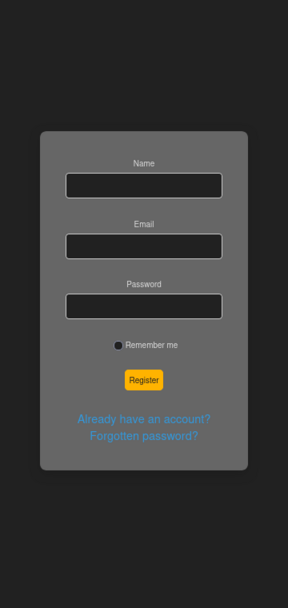

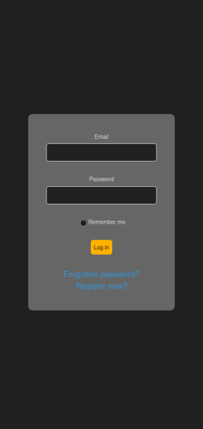


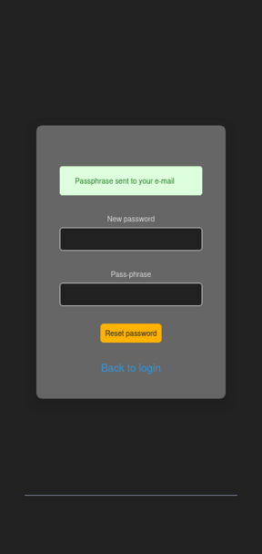

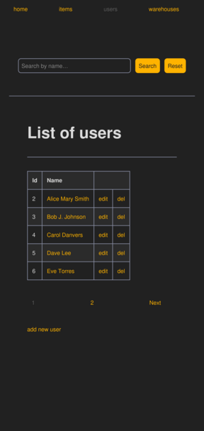

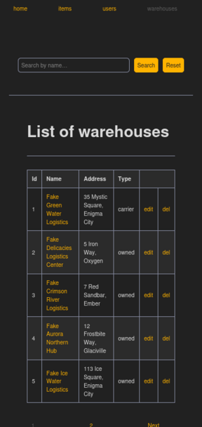

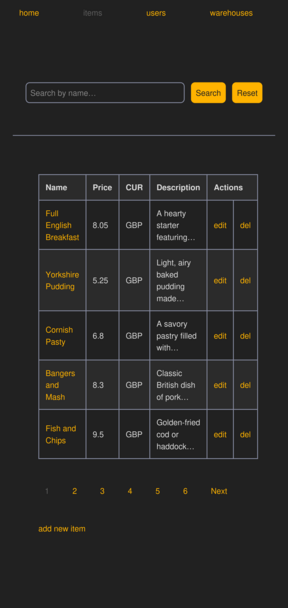

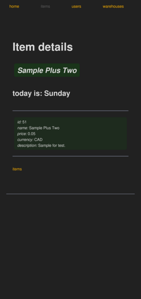

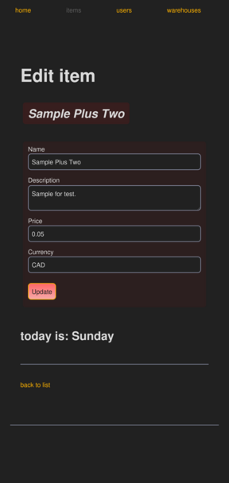

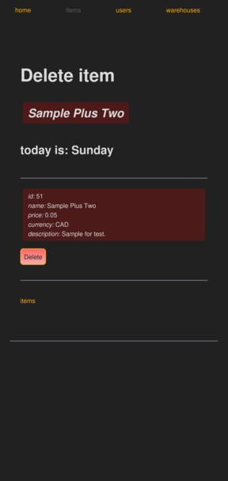

Here's how I used ImageMagick to resize images:

```shell
convert register_mobile_view.png -resize 80% -quality 95 register_mobile_view.png
convert login_mobile_view.png -resize 80% -quality 95 login_mobile_view.png
convert forgot_password_mobile_view.png -resize 80% -quality 95 forgot_password_mobile_view.png
convert reset_password_with_passphrase_mobile_view.png -resize 80% -quality 95 reset_password_with_passphrase_mobile_view.png
convert users_mobile.png -resize 80% -quality 95 users_mobile_view.png
convert warehouses_mobile.png -resize 80% -quality 95 warehouses_mobile_view.png
convert items_mobile.png -resize 80% -quality 95 items_mobile_view.png
convert item_delete_mobile_view.png -resize 80% -quality 95 item_delete_mobile_view.png
convert item_read_mobile_view.png -resize 80% -quality 95 item_read_mobile_view.png
convert item_update_mobile_view.png -resize 80% -quality 95 item_update_mobile_view.png
convert new_item_required_field_tooltip_mobile_view.png -resize 60% -quality 95 new_item_required_field_tooltip_mobile_view.png
convert item_new_modal_confirm_view.png -resize 60% -quality 95 item_new_modal_confirm_view.png
convert new_user_required_field_tooltip_mobile_view.png -resize 60% -quality 95 new_user_required_field_tooltip_mobile_view.png
convert new_warehouse_required_field_tooltip_mobile_view.png -resize 60% -quality 95 new_warehouse_required_field_tooltip_mobile_view.png
```

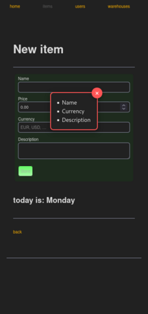

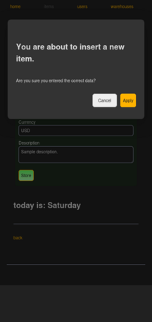

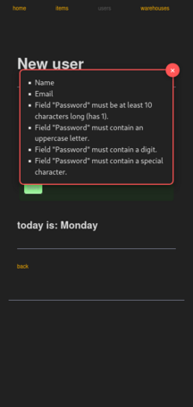

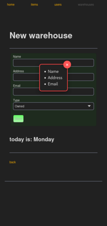

## scaffolding

Here's a series of useful shell commands for scaffolding the project:

```shell
mkdir PlumeletPHP && cd PlumeletPHP
composer init --help
composer init --verbose --name=plumeletphp/app --description="demo framework" --type=project --license=MIT --autoload=src/App
```

If you make changes to the composer.json file, remember to correct them and then regenerate autoloading.

### autoload

Now is the time to regenerate the autoloading:

```shell
composer dump-autoload
```

## packages

Here I will start adding the dependencies that I consider necessary for now:

```shell
composer require guzzlehttp/psr7 httpsoft/http-emitter league/route php-di/php-di vlucas/phpdotenv filp/whoops monolog/monolog adhocore/jwt egulias/email-validator
```

Install `league/plates` separately, preferring a stable version:

```shell
composer require league/plates --prefer-stable
```

### testing with `Pest`

```shell
composer require --dev pestphp/pest phpunit/phpunit
```

and after having appropriately modified the composer.json file and added pest.php and phpunit.xml to the root of the project:

```shell
composer dump-autoload
composer test
```

### tips

To see if a certain type of package is installed:

```shell
composer show --name-only | grep monolog
```

## PHP built-in web server

Now I proceed to start the built-in web server offered by PHP itself:

```shell
php -h
php -S localhost:8080 -t ./public/
```

## PHP interactive shell thanks readline extension

The PHP interactive shell can be useful in case you want to test some constructs of the programming language:

```shell
php -a
```

## how to create a local Git repository

**Commands to be typed on the development host.**

Create a `.gitignore` file:

```shell
nano .gitignore
```

Edit `.gitignore` file:

```txt
.vscode/
.notes/
vendor/
storage/
.env
```

Then give the following commands:

```shell
git --help
git init
git branch -m main
git status
git config user.email "developer@example.local"
git config user.name "developer"
git add .
git commit -m "initializing the local repository"
git tag -a v0.0.0 -m "starting version of clean repo"
git log
git checkout -b staging
git checkout -b draft
git checkout -b wip
git branch --list | wc -l
git branch --list
```

And, after each change, the cycle repeats:

```shell
git status
git add .
git commit -m "further adjustments"
git tag -a v0.0.1 -m "further adjustments"
git log
git checkout draft
git merge --no-ff wip -m "merge wip into draft"
git checkout staging
git merge --no-ff draft -m "merge draft into staging"
git checkout main
git merge --no-ff staging -m "merge staging into main"
git checkout wip
```

If something were to go wrong:

```shell
git reset --hard v0.0.0
```

## MariaDB database

Command to connect to the development database:

```shell
mariadb --user=developer_name --password --pager
```

## custom class for debugging

```php
\App\Util\Handlers\VarDebugHandler::varDump($var);
\App\Util\Handlers\VarDebugHandler::varExport($var);
```

## converting an SVG file into a favicon

```shell
convert -background none plumeletphp_ico.svg -resize 64x64 favicon-64.png && \
convert -background none plumeletphp_ico.svg -resize 48x48 favicon-48.png && \
convert -background none plumeletphp_ico.svg -resize 32x32 favicon-32.png && \
convert -background none plumeletphp_ico.svg -resize 16x16 favicon-16.png && \
convert favicon-16.png favicon-32.png favicon-48.png favicon-64.png favicon.ico && \
rm favicon-16.png favicon-32.png favicon-48.png favicon-64.png
```

## reset credentials

One of the basic features of a management system is to offer the user/operator who has forgotten their password the ability to quickly restore access with renewed credentials.
A common way to do this is to send, when prompted, a passphrase to the user's email address, which was provided during registration.

During development and testing, I created a class that, instead of actually sending, writes the following message to a file in the development file system that might look something like this:

```txt
To: john.doe@example.local
Subject: reset passphrase

Your password reset passphrase: this_is_where_the_sample_passphrase_would_be_visible
```

After that, the user simply needs to type or have the browser generate a suitably complex password in the designated field and the passphrase in the next one, press Enter and proceed with the login using the new password.
