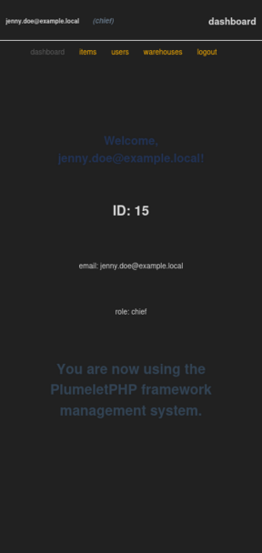
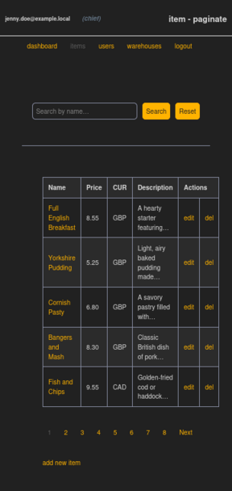
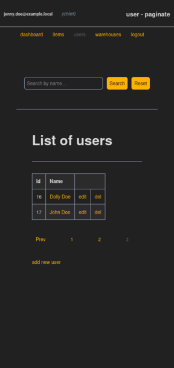
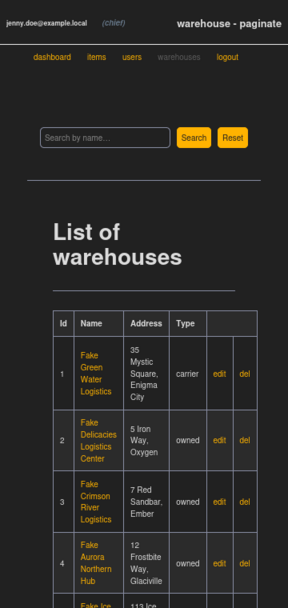
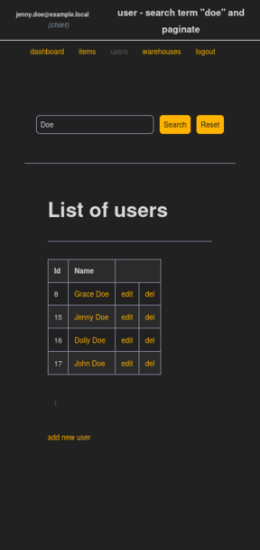
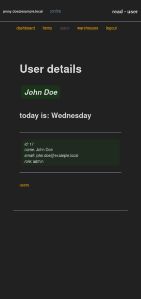
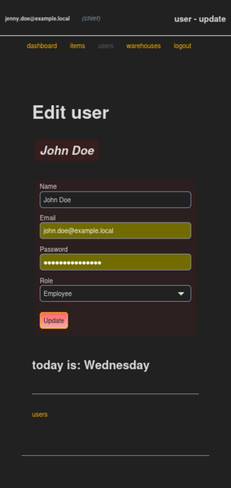
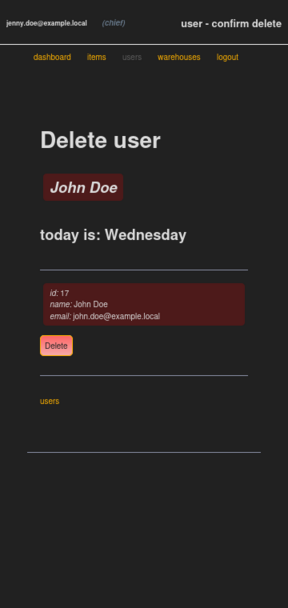
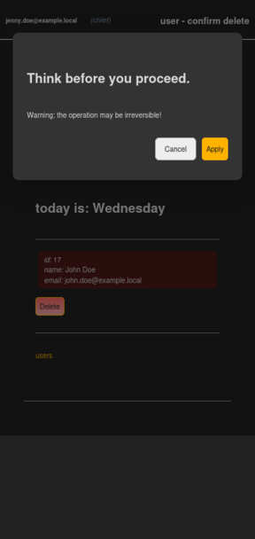
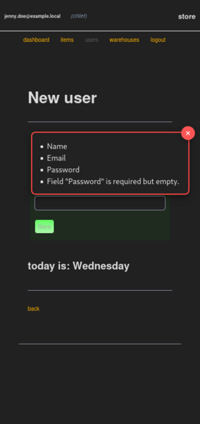

# PlumeletPHP


Professionally developed personal PHP framework for demonstration purposes.

Plumelet, a word that literally means a small feather or tuft of feathers.
I chose this word because it denotes the lightness of this demonstration framework.

This project is licensed under the MIT License.
See the License file for details.

The official MIT license website is an excellent resource for learning more.
You can visit the official MIT License website at the following link: <https://opensource.org/license/mit> or more generally: <https://opensource.org/licenses>

By visiting these websites and reading the information provided, you can gain a better understanding of the MIT License and how to use it effectively.

## screenshots

**To avoid any misunderstanding, the names and places appearing in the following screenshots are completely imaginary, invented for demonstration purposes and do not refer to anything or anyone!**






















Here's how I used ImageMagick to resize images:

```shell
convert register_mobile_view.png -resize 80% -quality 95 register_mobile_view.png
convert login_mobile_view.png -resize 80% -quality 95 login_mobile_view.png
convert forgot_password_mobile_view.png -resize 80% -quality 95 forgot_password_mobile_view.png
convert reset_password_with_passphrase_mobile_view.png -resize 80% -quality 95 reset_password_with_passphrase_mobile_view.png
convert dashboard_mobile_view.png -resize 80% -quality 95 dashboard_mobile_view.png
convert items_paginate_mobile_view.png -resize 80% -quality 95 items_paginate_mobile_view.png
convert users_paginate_mobile_view.png -resize 80% -quality 95 users_paginate_mobile_view.png
convert warehouses_paginate_mobile_view.png -resize 80% -quality 95 warehouses_paginate_mobile_view.png
convert search_user_mobile_view.png -resize 80% -quality 95 search_user_mobile_view.png
convert user_read_mobile_view.png -resize 80% -quality 95 user_read_mobile_view.png
convert user_update_mobile_view.png -resize 80% -quality 95 user_update_mobile_view.png
convert user_delete_mobile_view.png -resize 80% -quality 95 user_delete_mobile_view.png
convert user_confirm_delete_mobile_view.png -resize 80% -quality 95 user_confirm_delete_mobile_view.png
convert new_user_mobile_view.png -resize 80% -quality 95 new_user_mobile_view.png
```

## virtual machine

Assuming you want to use `libvirt` as an open-source API, daemon, and management tool as your virtualization platform, given its support for numerous hypervisors, the following commands would be useful:

```shell
su -
virsh
```

After that, if the virtual network does not start by default:

```shell
net-list
net-start default
list --all
start virtual-machine-name
dominfo virtual-machine-name
domifaddr virtual-machine-name
```

Otherwise, more simply:

```shell
list --all
start virtual-machine-name
dominfo virtual-machine-name
domifaddr virtual-machine-name
```

And finally, once you've finished your development session and stopped the virtual machine from within it, you can finish with the following command:

```shell
quit
```

## on-premise provisioning

### directory creation

```shell
ssh developer_username@192.168.XXX.XXX
su -
cd /var/www/html/
mkdir -p plumeletphp.local/public
nano index.php
```

If it is not already present, I edit a simple index to use as a placeholder that informs about the executive environment:

```php
<? phpinfo(INFO_ALL);
```

I copy the placeholder inside the public directory:

```shell
cp index.php plumeletphp.local/public/
chown --recursive developer_username:apache plumeletphp.local/
cd ~
```

### parameter for generate keys:

Here is just an example of the parameters to keep on hand:

```text
[national_acronym]
[state]
[city]
plumeletphp.local
plumeletphp.local
plumeletphp.local
[webmaster@localhost]
```

It is obvious that the first three parameters must be appropriately valued.

Therefore I can proceed with the generation of the self-signed certificate without the passphrase thanks to the `-nodes` flag:

```shell
ls -al /etc/ssl/
openssl req -new -x509 -nodes -days 365 -newkey rsa:2048 -keyout /etc/ssl/private/plumeletphp.local.key -out /etc/ssl/certs/plumeletphp.local.crt
ls -al /etc/ssl/private/
ls -al /etc/ssl/certs/
```

### file `/etc/httpd/conf.d/plumeletphp.local.conf`

```shell
nano /etc/httpd/conf.d/plumeletphp.local.conf
```

```xml
<VirtualHost *:80>
        ServerAdmin webmaster@localhost
        ServerName plumeletphp.local
        ServerAlias www.plumeletphp.local
        DocumentRoot /var/www/html/plumeletphp.local/public
        Redirect permanent "/" "https://plumeletphp.local/"
</VirtualHost>

<VirtualHost *:443>
        ServerAdmin webmaster@localhost
        ServerName plumeletphp.local
        ServerAlias www.plumeletphp.local
        DocumentRoot /var/www/html/plumeletphp.local/public

        <Directory /var/www/html/plumeletphp.local/public>
                Options Indexes FollowSymLinks MultiViews
                AllowOverride All
                Require all granted
                DirectoryIndex index.php
        </Directory>

        SSLEngine on

        SSLCertificateFile /etc/ssl/certs/plumeletphp.local.crt
        SSLCertificateKeyFile /etc/ssl/private/plumeletphp.local.key

        ErrorLog /var/log/httpd/plumeletphp_error_log

        <FilesMatch "\.(cgi|shtml|phtml|php)$">
                SSLOptions +StdEnvVars
        </FilesMatch>
</VirtualHost>
```

### environment setup

With developer user credentials:

```shell
apachectl configtest
systemctl reload httpd
systemctl status httpd --no-pager
```

If I encounter any problems I can investigate with the following command:

```shell
tail -n 5 /var/log/httpd/plumeletphp_error_log
```

If you receive reports about file permission issues, you can proceed with the following commands:

```shell
chmod -R 755 /var/www/html/plumeletphp.local/public/
chmod -R 644 /var/www/html/plumeletphp.local/public/*.php
restorecon -Rv /var/www/html/plumeletphp.local/
systemctl restart httpd
systemctl status httpd --no-pager
exit
```

## setup of `/etc/hosts` on the host used for development

I edit the following configuration file:

```shell
nano /etc/hosts
```

and I add this line:

```txt
192.168.XXX.XXX         plumeletphp.local       www.plumeletphp.local           # PlumeletPHP
```

**Obviously, the correct values of your IP address of interest must be inserted in place of the Xs.**

## setup of vscode

Edit sftp.json like this:

```json
{
  "$schema": "http://json-schema.org/draft-07/schema",
  "name": "plumeletphp.local",
  "username": "developer_username",
  "privateKeyPath": "/home/developer_username/.ssh/id_rsa",
  "passphrase": "developer_passphrase",
  "host": "192.168.XXX.XXX",
  "remotePath": "/var/www/html/plumeletphp.local",
  "port": 22,
  "connectTimeout": 20000,
  "uploadOnSave": true,
  "watcher": {
    "files": "dist/*.{js,css}",
    "autoUpload": false,
    "autoDelete": false
  },
  "syncOption": {
    "delete": true,
    "update": false
  },
  "ignore": [
    ".vscode",
    ".howto",
    ".setup",
    ".git",
    ".DS_Store",
    "*.rest",
    "*.sql",
    "TEMP",
    "nbproject",
    "probe.http",
    "README.md"
  ]
}
```

**Please note, you will need to remember to set the `username`, `privateKeyPath`, `passphrase` and `host` fields appropriately.**

**Again, the correct values of your IP address of interest must be inserted in place of the Xs.**

Edit settings.json like this:

```json
{
  "cSpell.language": "en,it,la",
  "files.associations": {
    "*.css": "tailwindcss"
  },
  "tailwindCSS.includeLanguages": {
    "html": "html",
    "javascript": "javascript",
    "css": "css"
  },
  "editor.quickSuggestions": {
    "strings": true
  },
  "intelephense.diagnostics.undefinedMethods": false,
  "cSpell.words": [],
  "editor.defaultColorDecorators": "auto",
  "editor.colorDecoratorsLimit": 5000
}
```

## scaffolding

Here are a few useful shell commands to create the project structure for use via SSH on the host hosting the web application, using the developer's credentials:

```shell
cd /var/www/html/plumeletphp.local/
mkdir -p src/App
composer --version
composer init --help
composer init --no-interaction \
    --name=plumeletphp/app \
    --description="demo framework" \
    --type=project \
    --license=MIT \
    --autoload=src/App/
chown --recursive developer_username:apache .
```

If you make changes to the composer.json file, remember to correct them and then regenerate autoloading.

### autoload

Now is the time to regenerate the autoloading:

```shell
composer dump-autoload
```

### autoload check

Before continuing, it would be a good idea to check that autoload is working correctly.

If you want, you could start by creating the Hello class in `src/App`:

```php
<?php

namespace Plumeletphp\App;

class Hello
{
    public function hello(): string
    {
        return "Autoload works fine!";
    }
}
```

To then edit the `autoload_check.php` file in the root of the project:

```php
<?php

require __DIR__ . '/vendor/autoload.php';

use Plumeletphp\App\Hello;

$hello = new Hello;

echo $hello->hello() . PHP_EOL;
```

Finally, the actual verification will be done from the shell:

```shell
php autoload_check.php
```

## packages

Here I will start adding the dependencies that I consider necessary for now:

```shell
composer require guzzlehttp/psr7 \
    httpsoft/http-emitter \
    league/route \
    php-di/php-di \
    vlucas/phpdotenv \
    filp/whoops \
    monolog/monolog \
    adhocore/jwt \
    egulias/email-validator
```

Install `league/plates` separately, preferring a stable version:

```shell
composer require league/plates --prefer-stable
```

### testing with `Pest`

```shell
composer require --dev pestphp/pest phpunit/phpunit
```

### make `tests` directory

```shell
mkdir -p tests/Test
touch tests/Test/SampleTest.php
chown --recursive developer_username:apache .
chmod -R 755 ./tests/
chmod -R 644 ./tests/Test/*.php
```

Edit `tests/Test/SampleTest.php` like this:

```php
<?php

declare(strict_types=1); // Enforce strict type checking

/**
 * Adds two integers and returns an integer.
 *
 * @param integer $a
 * @param integer $b
 * @return integer
 */
function add(int $a, int $b): int
{
    return $a + $b;
}

/**
 * Reverses a string using PHP's built-in `strrev()` function.
 *
 * @param string $str
 * @return string
 */
function reverse(string $str): string
{
    return strrev($str);
}

test('add() returns a sum of integers', function () {
    // Expect add(1, 2) to equal 3.
    expect(add(1, 2))->toBe(3);
    // Expect add(3, -3) to equal 0.
    expect(add(3, -3))->toBe(0);
    // Expect add(4, -5) to equal -1.
    expect(add(4, -5))->toBe(-1);
});

test('reverse() returns a reversed string', function () {
    // Expect reverse("desserts") to equal "stressed".
    expect(reverse("desserts"))->toBe("stressed");
    // Expect reverse("PHP") to equal "PHP".
    expect(reverse("PHP"))->toBe("PHP");
});
```

Now I added these lines:

```json
    "autoload-dev": {
        "psr-4": {
            "Plumeletphp\\Test\\": "tests/Test/"
        }
    },
```

after autoload section and this lines:

```json
    ,
    "scripts": {
        "test": "vendor/bin/pest"
    }
```

at the end of `composer.json` file.

Add `pest.php` and `phpunit.xml` to the root of the project:

```shell
composer dump-autoload
composer test
```

or, more simply:

```shell
ls -l vendor/bin/pest
vendor/bin/pest
```

### tips

To see if a certain type of package is installed:

```shell
composer show --name-only | grep monolog
```

The following setting in `.vscode/settings.json` prevents any plugin from interfering with the pure CSS syntax:

```json
    "files.associations": {
        "*.tw.css": "tailwindcss"
    }
```

## a simple debugging test

### setup

You will need to create the following file: `.vscode/launch.json`:

```json
{
  "version": "0.2.0",
  "configurations": [
    {
      "name": "Listen for Xdebug",
      "type": "php",
      "request": "launch",
      "port": 9003,
      "pathMappings": {
        "/var/www/html/plumeletphp.local/public": "${workspaceFolder}/public"
      }
    }
  ]
}
```

Alright, now you need to be careful when configuring the value of `"pathMappings"`. The first part, `"/var/www/html/plumeletphp.local/public"`, has to precisely match the remote path, while the second part needs to correspond to the code that's written locally, like in example `"${workspaceFolder}/public"`.

### debug

Add file `debug.php` to the project, in directory `/var/www/html/plumeletphp.local/public/`, by typing the following content:

```php
<?php

declare(strict_types=1); // Enforce strict type checking

// example of debugging an iteration that uses a constant

xdebug_break();

const WELCOME = "Welcome to demo iteration number ";
$sample       = "";

for ($i = 0; $i < 10; $i++) {
    $sample = WELCOME . $i . "!<br>";
    echo $sample;
}
```

Start debugging from `vscode` and, at the same time, point to address <https://192.168.XXX.XXX/debug.php> from the browser.
Attention, remember to replace the placeholder `192.168.XXX.XXX` with your IP address.

Have a good analysis and debugging session.

### a little cunning

Creating a file named `stubs/xdebug.php` in the project's root directory and adding the following content might prevent the code editor from identifying function `xdebug_break()` as unknown and type something similar to the following code:

```php
<?php

declare(strict_types=1); // Enforce strict type checking

if (! function_exists('xdebug_break')) {
    function xdebug_break(): void
    {}
}
```

## PHP built-in web server

Now I proceed to start the built-in web server offered by PHP itself:

```shell
php -h
php -S localhost:8080 -t ./public/
```

## PHP interactive shell thanks readline extension

The PHP interactive shell can be useful in case you want to test some constructs of the programming language:

```shell
php -a
```

## how to create a local Git repository

**Commands to be typed on the development host.**

Create a `.gitignore` file:

```shell
nano .gitignore
```

Edit `.gitignore` file:

```txt
.vscode/
.notes/
.tests/
vendor/
stores/
stubs/
*.pdf
*.env
*.log
*.cache
```

Then give the following commands:

```shell
git --help
git init
git branch -m main
git status
git config user.email "developer@example.local"
git config user.name "developer"
git add .
git commit -m "initializing the local repository"
git tag -a v0.0.0 -m "starting version of clean repo"
git log
git checkout -b staging
git checkout -b draft
git checkout -b wip
git branch --list | wc -l
git branch --list
```

And, after each change, the cycle repeats:

```shell
git status
git add .
git commit -m "further adjustments"
git log -3
git tag -a v0.0.1 -m "further adjustments"
git branch --list
```

Once the changes have been verified as working, the other branches of the repository can also be updated in cascade:

```shell
git checkout draft && \
git merge --no-ff wip -m "merge wip into draft" && \
git checkout staging && \
git merge --no-ff draft -m "merge draft into staging" && \
git checkout main && \
git merge --no-ff staging -m "merge staging into main" && \
git checkout wip
```

If something were to go wrong:

```shell
git reset --hard v0.0.0
```

## MariaDB database

Command to connect to the development database:

```shell
mariadb --user=developer_name --password --pager
```

## custom class for debugging

```php
\App\Util\Handlers\VarDebugHandler::varDump($var);
\App\Util\Handlers\VarDebugHandler::varExport($var);
```

## converting an SVG file into a favicon

```shell
convert -background none plumeletphp_ico.svg -resize 64x64 favicon-64.png && \
convert -background none plumeletphp_ico.svg -resize 48x48 favicon-48.png && \
convert -background none plumeletphp_ico.svg -resize 32x32 favicon-32.png && \
convert -background none plumeletphp_ico.svg -resize 16x16 favicon-16.png && \
convert favicon-16.png favicon-32.png favicon-48.png favicon-64.png favicon.ico && \
rm favicon-16.png favicon-32.png favicon-48.png favicon-64.png
```

## reset credentials

One of the basic features of a management system is to offer the user/operator who has forgotten their password the ability to quickly restore access with renewed credentials.
A common way to do this is to send, when prompted, a passphrase to the user's email address, which was provided during registration.

During development and testing, I created a class that, instead of actually sending, writes the following message to a file in the development file system that might look something like this:

```txt
To: john.doe@example.local
Subject: reset passphrase

Your password reset passphrase: this_is_where_the_sample_passphrase_would_be_visible
```

After that, the user simply needs to type or have the browser generate a suitably complex password in the designated field and the passphrase in the next one, press Enter and proceed with the login using the new password.
